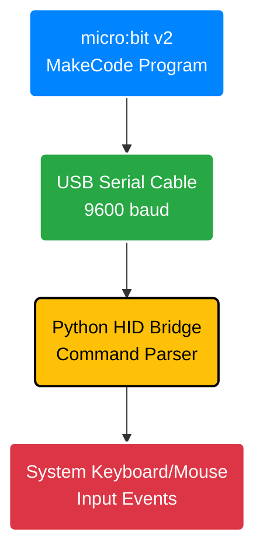
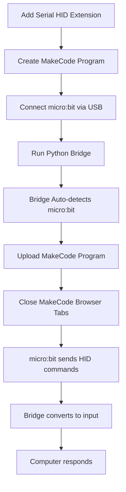

# micro:bit Serial HID Extension

Transform your micro:bit into a keyboard and mouse controller for your computer. This complete project includes both the MakeCode extension and Python bridge that automatically handles the connection between your micro:bit and your computer's input system.

## How It Works



Your micro:bit sends commands like `HID:KEY:Hello` over serial. The Python bridge converts these to actual keyboard/mouse input.


## Smart Features

**Zero Configuration Setup** - The bridge automatically installs missing packages (pyserial and pynput) when you first run it, so you don't need to worry about dependencies.

**Intelligent Port Detection** - Your micro:bit is automatically discovered across Windows, macOS, and Linux without needing to specify port numbers.

**Automatic Reconnection** - If your micro:bit gets unplugged or the connection drops, the bridge keeps searching and automatically reconnects when it's plugged back in.

**Cross-Platform Compatibility** - Works seamlessly on Windows 10/11, macOS, and Linux distributions including Raspberry Pi.

## Complete Setup Process

Here's how everything works together from start to finish:



The beauty of this system is that steps 4-5 and 8-10 happen automatically. You just focus on creating your MakeCode program with the Serial HID extension, and the bridge handles all the technical details.

## Quick Start

### 1. Add Extension to MakeCode
1. Open [MakeCode for micro:bit](https://makecode.microbit.org)
2. Go to **Advanced → Extensions**
3. Import this repository URL: `https://github.com/[your-username]/MBV2_KeyboardHID`
4. Use the "SerialHID", "SerialKeyboard", and "SerialMouse" blocks

### 2. Create Basic Program
```javascript
serialHID.initialize()

input.onButtonPressed(Button.A, function () {
    serialKeyboard.typeText("Hello from micro:bit!")
    serialKeyboard.pressEnter()
})

input.onButtonPressed(Button.B, function () {
    serialMouse.move(10, 10)
    serialMouse.leftClick()
})
```

### 3. Install and Run Python Bridge
The easiest way to get started is using the auto-installer:

```bash
cd Python_HID_Bridge
python install_and_run.py
```

This automatically installs dependencies and starts the bridge. For manual control:

```bash
cd Python_HID_Bridge
pip install pyserial pynput
python microbit_hid_bridge.py
```

### 4. Run Everything
1. Upload program to micro:bit
2. **Close MakeCode browser tabs** (to release WebUSB)
3. Python bridge will auto-detect your micro:bit
4. Press buttons and control your computer!

## Requirements

**Python 3.6 or newer** is required. Most modern systems have this already installed.

**micro:bit v2** connected via USB cable. Version 1 micro:bits also work but v2 is recommended for better performance.

**Serial HID MakeCode Extension** must be added to your MakeCode project. Search for this repository URL in MakeCode extensions.

**Administrator privileges** are needed for the script to control keyboard and mouse input. On Windows run Command Prompt as Administrator, on macOS grant Accessibility permissions in System Preferences, and on Linux add your user to the dialout group.

## Installation by Platform

**Windows Users** can run `python install_and_run.py` directly. If prompted, allow the script to install packages automatically. Run Command Prompt as Administrator to ensure proper permissions for keyboard and mouse control.

**macOS Users** should grant Accessibility permissions when prompted. Go to System Preferences → Security & Privacy → Privacy → Accessibility and add Terminal or your Python application to the allowed list.

**Linux Users** need to add themselves to the dialout group for serial port access:
```bash
sudo usermod -a -G dialout $USER
```
Then log out and back in for the changes to take effect.

## MakeCode Extension Usage

Add the Serial HID extension to your MakeCode project, then use these namespaces:

**serialHID.initialize()** must be called once at the start of your program to set up the serial communication.

**serialKeyboard** provides functions like `typeText("Hello")`, `pressKey("ENTER")`, and `pressEnter()` for keyboard control.

**serialMouse** provides functions like `move(10, 5)`, `leftClick()`, and `scroll(3)` for mouse control.

## Communication Protocol

The bridge listens for specially formatted commands from your micro:bit. All commands follow this pattern:

```
HID:DEVICE:ACTION:DATA
```

**Keyboard Commands** let you type text, press special keys, and create key combinations:

```
HID:KEY:TYPE:Hello World        # Types the text "Hello World"
HID:KEY:PRESS:ENTER            # Presses the Enter key
HID:KEY:COMBO:CTRL+C           # Presses Ctrl+C combination
```

**Mouse Commands** control cursor movement, clicking, and scrolling:

```
HID:MOUSE:MOVE:10,5            # Moves cursor 10 pixels right, 5 down
HID:MOUSE:CLICK:LEFT           # Left mouse click
HID:MOUSE:SCROLL:3             # Scrolls up 3 units
HID:MOUSE:HOLD:LEFT            # Holds left button down
HID:MOUSE:RELEASE:ALL          # Releases all held buttons
```

## Command Line Options

The bridge supports several options for different use cases:

**--port** lets you specify a serial port manually if auto-detection fails. Example: `--port COM3` on Windows or `--port /dev/ttyACM0` on Linux.

**--debug** enables detailed logging so you can see exactly what commands are being received and processed. This is helpful for troubleshooting.

**--no-reconnect** disables the automatic reconnection feature if you prefer the old behavior where the bridge exits when disconnected.

**--list-ports** shows all available serial ports on your system, which is useful for manual port specification.

Full command examples:
```bash
cd Python_HID_Bridge
python microbit_hid_bridge.py --debug --no-reconnect
python microbit_hid_bridge.py --port COM3 --debug
python microbit_hid_bridge.py --list-ports
```

## Project Structure

```
MBV2_KeyboardHID/
├── pxt.json, *.ts              # MakeCode extension files
├── Python_HID_Bridge/          # Python companion app with auto-installer
│   ├── install_and_run.py      # Auto-installer and runner
│   ├── microbit_hid_bridge.py  # Main bridge application
│   └── requirements.txt        # Python dependencies
├── Microbit_Examples/          # Working example programs
│   ├── tilt_mouse_control.js   # Motion-controlled mouse
│   └── README.md              # Example documentation
├── Extension_README.md         # MakeCode extension documentation
└── README.md                  # This file
```

## Working Examples

The project includes several complete working examples in the `Microbit_Examples` folder:

**Tilt Mouse Control** - Use your micro:bit's accelerometer to control the mouse cursor like a joystick. Tilt to move, buttons to click, shake to double-click.

**Simple Controls** - Basic button-based keyboard and mouse controls that you can copy and paste directly into MakeCode.

Check the `Microbit_Examples/README.md` for complete instructions and code for these examples.

## Troubleshooting Common Issues

**"Could not find micro:bit"** usually means either the micro:bit isn't connected, or the USB cable only provides power without data connection. Try a different USB cable or port. You can also run `--list-ports` to see what devices are available.

**Permission denied errors** happen when the script can't access input control. On Windows, run as Administrator. On macOS, grant Accessibility permissions. On Linux, ensure you're in the dialout group.

**Nothing happens when sending commands** typically indicates either the MakeCode program isn't running, MakeCode browser tabs are still open (blocking WebUSB), or the wrong command format is being sent. Enable debug mode with `--debug` to see exactly what commands are being received.

**Package installation fails** can occur in restricted environments. The bridge will show specific error messages and fall back to manual installation instructions.

**Serial port conflicts** happen when another program is using the micro:bit's serial connection. Most commonly this is MakeCode's console or simulator still connected via WebUSB. **Always close all MakeCode browser tabs after flashing your program** to release the serial connection.

**Commands are ignored** usually means MakeCode is still connected via WebUSB. Click "Disconnect" in MakeCode or close all browser tabs with MakeCode open.

## Platform-Specific Notes

**Windows 10 and 11** provide the best plug-and-play experience with automatic driver installation and port detection working reliably.

**macOS** requires one-time Accessibility permission setup, but otherwise works perfectly. The permission dialog will appear automatically when first running the bridge.

**Linux distributions** including Ubuntu, Debian, and Raspberry Pi OS work excellently once the dialout group permission is set up. Some newer distributions may require additional permissions for input simulation.

**Raspberry Pi** makes an excellent dedicated bridge device, allowing you to control other computers over the network or create standalone kiosk systems.


## Security and Safety

This software can control your computer's keyboard and mouse, which is a powerful capability that should be used responsibly. Only run the bridge with micro:bit programs you trust, as malicious code could potentially control your computer in unexpected ways.

The bridge requires elevated permissions to simulate keyboard and mouse input. This is a normal requirement for any software that needs to control system input, similar to screen readers or automation tools.

All communication happens over the local USB serial connection. No network connections are made, and no data is transmitted outside your computer.

## Advanced Usage

For developers building complex applications, the bridge supports multiple simultaneous connections and can be easily modified to support additional input types or custom command protocols.

The source code is well-documented and follows Python best practices, making it easy to extend with new features or integrate into larger projects.

Debug mode provides detailed logging of all operations, making it easy to understand exactly how commands are processed and troubleshoot any issues that arise.

The automatic reconnection feature can be disabled for applications that need to handle disconnections differently, providing flexibility for various use cases.

## Credits

This project was inspired by the excellent [micro:bit Bluetooth HID extension](https://github.com/bsiever/microbit-pxt-blehid) by Bill Siever. Our serial-based approach provides an alternative that frees up the radio antenna for other uses.

## License

MIT License - Use freely for personal and commercial projects!

---

*Created with RedBull and coffee by [creativetech.wtf](https://creativetech.wtf)* 