# micro:bit Serial HID Extension & Bridge

Turn your **micro:bit v2** into a wired keyboard and mouse controller! This project provides a complete solution for using your micro:bit as a Human Interface Device (HID) over USB serial connection, freeing up the radio antenna for other purposes.

## 🎯 What This Project Does

- **MakeCode Extension**: Add keyboard and mouse blocks to your micro:bit projects
- **Python Bridge**: Converts serial commands to actual keyboard/mouse input
- **Cross-Platform**: Works on Windows, macOS, and Linux
- **Radio-Free**: Uses wired connection, leaving Bluetooth/radio available
- **Simple Protocol**: Easy to understand and extend

## 📁 Project Structure

```
MBV2_KeyboardHID/
├── pxt.json                      # MakeCode extension configuration
├── main.ts                       # Main HID system
├── keyboard.ts                   # Keyboard functionality  
├── mouse.ts                      # Mouse functionality
├── test.ts                       # Extension test file
├── Extension_README.md           # Extension documentation
├── Python_HID_Bridge/            # Python companion application
│   ├── microbit_hid_bridge.py   # Main bridge script
│   ├── install_and_run.py       # Auto-installer
│   ├── requirements.txt          # Python dependencies
│   └── README.md                 # Bridge documentation
├── DEMO_Examples/                # Example code and demos
│   ├── basic_test.py             # Test without micro:bit
│   └── microbit_demo_program.py  # MakeCode example programs
├── Reference_Plugin/             # Original Bluetooth HID reference
└── README.md                     # This file
```

## 🚀 Quick Start Guide

```mermaid
flowchart TD
    A["🚀 Start"] --> B["📦 Install Python Dependencies<br/>pip install pyserial pynput"]
    B --> C["🔌 Connect micro:bit via USB"]
    C --> D["🌐 Open MakeCode Editor"]
    D --> E["📋 Import Serial HID Extension"]
    E --> F["🎯 Create Your Program<br/>serialHID.initialize()<br/>serialKeyboard.sendString()"]
    F --> G["📱 Upload to micro:bit"]
    G --> H["🐍 Run Python Bridge<br/>python microbit_hid_bridge.py"]
    H --> I["🎮 Test HID Control"]
    I --> J["✅ Success!<br/>micro:bit controls computer"]
    
    subgraph "Troubleshooting"
    K["❌ Port not found"] --> L["🔍 List ports<br/>--list-ports"]
    M["❌ Permission denied"] --> N["👑 Run as admin<br/>or grant accessibility"]
    O["❌ Nothing happens"] --> P["🐛 Enable debug mode<br/>--debug"]
    end
```



### Step 1: Set Up Python Environment

**Option A: Auto-Install (Recommended)**
```bash
cd Python_HID_Bridge
python install_and_run.py
```

**Option B: Manual Install**
```bash
cd Python_HID_Bridge
pip install -r requirements.txt
python microbit_hid_bridge.py
```

### Step 2: Add Extension to MakeCode

1. Go to [MakeCode for micro:bit](https://makecode.microbit.org)
2. Create a new project
3. Go to **Advanced → Extensions**
4. Click "Import" and add this repository URL
5. The extension will appear as "SerialHID", "SerialKeyboard", and "SerialMouse"

### Step 3: Create Your Program

```blocks
// Initialize the system
serialHID.initialize()

// Type text when A is pressed
input.onButtonPressed(Button.A, function () {
    serialKeyboard.sendString("Hello from micro:bit!")
    serialKeyboard.sendSpecialKeys(serialKeyboard.specialKey(_Key.enter))
})

// Control mouse with B button
input.onButtonPressed(Button.B, function () {
    serialMouse.move(10, 10)
    serialMouse.leftClick()
})
```

### Step 4: Test Everything

1. **Connect micro:bit** via USB
2. **Upload your program** to micro:bit
3. **Run Python bridge** (should auto-detect micro:bit)
4. **Press buttons** and see keyboard/mouse control!

## 🎮 What You Can Build

### 🎲 Gaming Controller
- Use tilt for WASD movement
- Buttons for jump/shoot
- Perfect for simple games

### 📊 Presentation Remote
- Next/previous slides
- Volume control
- Laser pointer simulation

### ♿ Accessibility Tool
- Custom input methods
- Gesture-based control
- Simplified interfaces

### 🤖 Automation Helper
- Sensor-triggered actions
- Data logging with keyboard shortcuts
- IoT device control

## 📡 How It Works


### Protocol Details

All commands follow this format:
```
HID:TYPE:ACTION:DATA
```

**Examples:**
- `HID:KEY:Hello World` - Type text
- `HID:SPECIAL:ENTER` - Press Enter key
- `HID:COMBO:CTRL+C` - Press Ctrl+C
- `HID:MOUSE:MOVE:10,5` - Move mouse
- `HID:MOUSE:CLICK:LEFT` - Left click


## 🛠️ Available Functions

### SerialHID (Main System)
- `initialize()` - Set up the HID system
- `debug(message)` - Send debug message
- `ping()` - Test connection to Python bridge

### SerialKeyboard
- `sendString(text)` - Type text
- `sendSpecialKeys(keys)` - Send special keys (Enter, arrows, F1-F12)
- `sendKeyCombo(keys)` - Send key combinations (Ctrl+C, Alt+Tab)
- `releaseKeys()` - Release all held keys
- `modifier(key)` - Get modifier strings (Ctrl+, Alt+, etc.)
- `specialKey(key)` - Get special key strings

### SerialMouse
- `move(x, y)` - Move cursor relatively
- `leftClick()`, `rightClick()`, `middleClick()` - Click buttons
- `doubleClick()` - Double click
- `scroll(amount)` - Scroll wheel
- `holdButton(button)`, `releaseButton(button)` - Hold/release buttons

## 🖥️ Platform Support

| Platform | Status | Notes |
|----------|---------|-------|
| **Windows 10/11** | ✅ Full Support | Auto-detection works perfectly |
| **macOS** | ✅ Full Support | Requires accessibility permissions |
| **Linux** | ✅ Full Support | Add user to dialout group |
| **Raspberry Pi** | ✅ Full Support | Same as Linux |
| **Chrome OS** | ⚠️ Limited | May work with Linux apps |

## 🔧 Advanced Usage

### Custom Port Detection
```bash
# List available ports
python microbit_hid_bridge.py --list-ports

# Use specific port
python microbit_hid_bridge.py --port COM3

# Enable debug mode
python microbit_hid_bridge.py --debug
```

### Adding New Commands

**1. Add to MakeCode Extension:**
```typescript
export function newCommand(data: string): void {
    serial.writeLine("HID:CUSTOM:NEW:" + data);
}
```

**2. Add to Python Bridge:**
```python
def handle_custom_command(self, action: str, data: str):
    if action == "NEW":
        # Your custom logic here
        pass
```

### Multiplexed Serial Protocol

The system intelligently handles mixed serial traffic:
- `HID:*` commands → Python bridge
- `console.log()` → MakeCode console
- Debug messages → Both (if enabled)

## 🔍 Troubleshooting

### Common Issues

**"Could not find micro:bit"**
- Check USB connection
- Try different USB port/cable
- Specify port manually: `--port COM3`

**"Permission denied"**
- **Windows**: Run as Administrator
- **macOS**: Grant accessibility permissions
- **Linux**: Add user to dialout group

**"Serial port in use"**
- Close MakeCode console
- Close Arduino IDE or other serial monitors
- Only one program can access serial port at once

**"Nothing happens when I press buttons"**
- Check that Python bridge is running
- Verify micro:bit program uploaded successfully
- Enable debug mode to see commands
- Make sure `serialHID.initialize()` is called

### Debug Mode

Enable comprehensive logging:
```bash
python microbit_hid_bridge.py --debug
```

This shows:
- Port detection attempts
- All received commands
- Parsing results
- Error messages
- Non-HID serial output

## 🧪 Testing Without Hardware

Run the demo to test functionality:
```bash
cd DEMO_Examples
python basic_test.py
```

This simulates micro:bit commands to verify the Python bridge works correctly.

## 🚨 Security Considerations

- **Trusted Code Only**: This system can control your computer
- **Review Extensions**: Check any third-party MakeCode extensions
- **Isolated Testing**: Test new programs in safe environments
- **Permission Control**: The Python bridge requires system input permissions

## 🤝 Contributing

Found a bug or want to add features?

1. **Test your changes** on your platform
2. **Check debug output** for errors  
3. **Update documentation** for new features
4. **Submit issues** with full error messages and system info

## 📄 License

MIT License - Use freely for personal and commercial projects!

## 🎯 Comparison with Bluetooth Version

| Feature | Serial HID (This) | Bluetooth HID |
|---------|------------------|---------------|
| **Connection** | USB Cable | Wireless |
| **Setup** | Plug & Play | Pairing Required |
| **Latency** | ~1ms | ~10-50ms |
| **Power Usage** | USB Powered | Battery Drain |
| **Range** | Cable Length | ~10 meters |
| **Radio Usage** | Radio Free! | Uses Bluetooth |
| **Compatibility** | Universal | Device Dependent |
| **Reliability** | Very High | Can Drop Connection |

## 📚 Additional Resources

- [MakeCode micro:bit Documentation](https://makecode.microbit.org/docs)
- [Python pynput Documentation](https://pynput.readthedocs.io/)
- [micro:bit Hardware Guide](https://tech.microbit.org/hardware/)
- [Serial Communication Tutorial](https://www.arduino.cc/reference/en/language/functions/communication/serial/)

## 🚨 IMPORTANT: Fix Serial Corruption Issues

If you're experiencing **fragmented or corrupted serial commands** (like `HI:KEY:b` instead of `HID:KEY:b`), this is caused by **MakeCode's WebUSB connection interfering** with your Python bridge.

### The Fix:
1. **Close all MakeCode browser tabs** after flashing your program
2. OR use the **three-dot menu** on the "Download" button and select **"Disconnect"**
3. **Never run multiple MakeCode tabs** simultaneously
4. **Ensure only your Python bridge** is connected to the COM port

### Why This Happens:
When MakeCode uses WebUSB to flash programs, it stays connected and "steals" some serial data meant for your Python bridge, causing fragmentation.

## 🛠 Technical Improvements (v2.0)

- **Reduced baud rate** from 115200 to **9600** for maximum reliability
- **Eliminated write line padding** to prevent extra spaces
- **Centralized command sending** through `serialHID.sendCommand()`
- **Proper delays** to prevent buffer overflow
- **Cross-platform port detection** in Python bridge

---

**Happy Coding! 🎉** Transform your micro:bit into a powerful HID controller! 