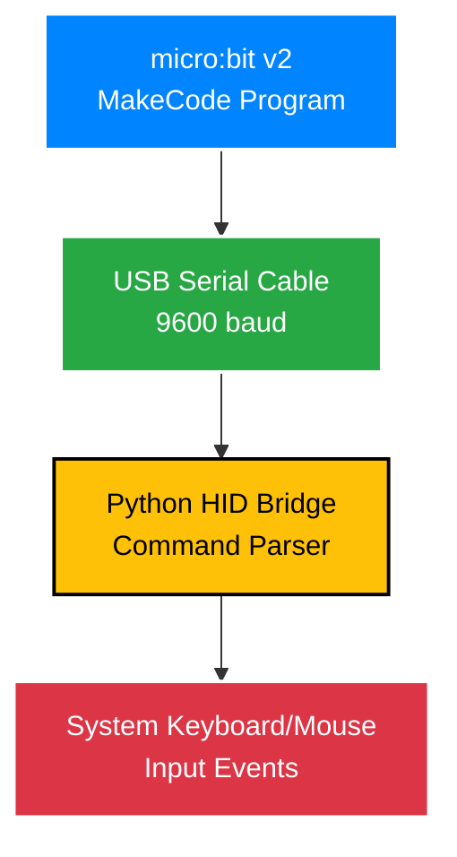

# micro:bit Serial HID Extension

Turn your micro:bit v2 into a wired keyboard and mouse controller over USB serial connection.

## Quick Setup

### 1. Install Python Dependencies
```bash
cd Python_HID_Bridge
pip install pyserial pynput
python microbit_hid_bridge.py
```

### 2. Add Extension to MakeCode
1. Open [MakeCode for micro:bit](https://makecode.microbit.org)
2. Go to **Advanced → Extensions**
3. Import this repository URL
4. Use the "SerialHID", "SerialKeyboard", and "SerialMouse" blocks

### 3. Basic Program
```javascript
// Initialize serial HID
serial.setBaudRate(BaudRate.BaudRate9600)
serial.writeLine("HID:INIT:SYSTEM")
basic.pause(200)

// Type text when A pressed
input.onButtonPressed(Button.A, function () {
    serial.writeLine("HID:KEY:Hello from micro:bit!")
    basic.pause(10)
    serial.writeLine("HID:SPECIAL:ENTER")
})

// Move mouse when B pressed  
input.onButtonPressed(Button.B, function () {
    serial.writeLine("HID:MOUSE:MOVE:10,10")
    basic.pause(10)
    serial.writeLine("HID:MOUSE:CLICK:LEFT")
})
```

### 4. Run Everything
1. Upload program to micro:bit
2. Close MakeCode browser tabs (to release WebUSB)
3. Run Python bridge - it will auto-detect your micro:bit
4. Press buttons and control your computer

## How It Works

<div align="center">



Your micro:bit sends commands like `HID:KEY:Hello` over serial. The Python bridge converts these to actual keyboard/mouse input.

</div>

## Protocol Commands

| Command | Example | Description |
|---------|---------|-------------|
| `HID:KEY:text` | `HID:KEY:Hello World` | Type text |
| `HID:SPECIAL:key` | `HID:SPECIAL:ENTER` | Special keys |
| `HID:COMBO:keys` | `HID:COMBO:CTRL+C` | Key combinations |
| `HID:MOUSE:MOVE:x,y` | `HID:MOUSE:MOVE:10,-5` | Move mouse |
| `HID:MOUSE:CLICK:button` | `HID:MOUSE:CLICK:LEFT` | Click mouse |

## Project Structure

```
MBV2_KeyboardHID/
├── pxt.json, *.ts          # MakeCode extension files
├── Python_HID_Bridge/      # Python companion app
├── DEMO_Examples/          # Working examples
└── README.md              # This file
```

## Examples

- **Tilt Mouse**: Use accelerometer to control mouse cursor
- **Presentation Remote**: Control slides with micro:bit buttons
- **Gaming Controller**: WASD movement from tilt sensors
- **Accessibility Tool**: Custom input methods

## Troubleshooting

**Port not found**: `python microbit_hid_bridge.py --list-ports`
**Permission denied**: Run as administrator or grant accessibility permissions
**Commands ignored**: Close MakeCode browser tabs to release WebUSB connection

## Credits

This project was inspired by the excellent [micro:bit Bluetooth HID extension](https://github.com/bsiever/microbit-pxt-blehid) by Bill Siever. Our serial-based approach provides an alternative that frees up the radio antenna for other uses.

For more creative tech projects, visit [creativetech.wtf](https://creativetech.wtf).

## License

MIT License 